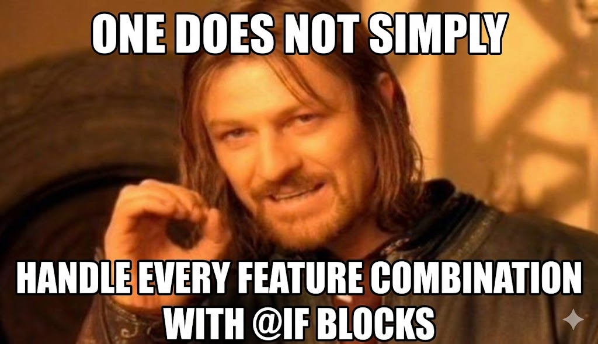
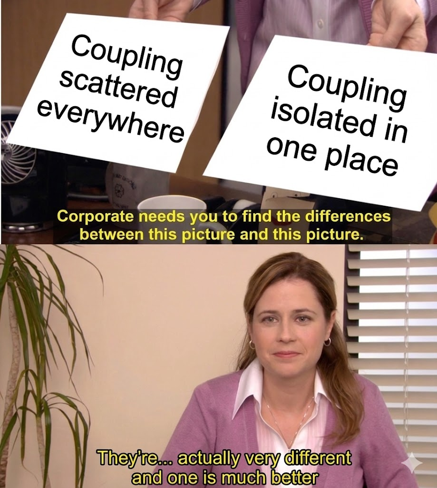
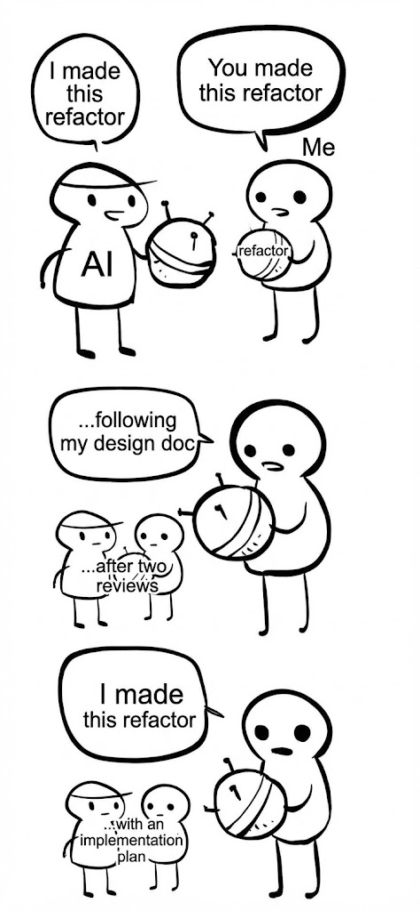

# Decoupling in Angular: Letting the Code Tell You What It Needs

## Full Talk Script (Final Version v2)

---

### Slide 1 – Hook

**On screen:**

```
Month 1: Clean component, 4 inputs
Month 6: 23 inputs, 14 outputs
Month 7: "Can we just add one more flag?"
```

**You say:**

"We rewrote Explore from scratch. Clean slate. No legacy baggage.

Month one: a component with four inputs, clear responsibility, easy to test.

Six months of feature expansion later: 23 inputs, 14 outputs, and a template that opened with three nested `@if` blocks before the first real element.

We didn't inherit this mess. We built it. One reasonable decision at a time."

---

**[MEME: "This is fine" dog in burning room]**

---

**You say:**

"The code wasn't wrong. It had just accumulated coupling in ways that made change expensive.

This talk is about how we took it apart - and the mental model I now use to recognize when it's time to restructure before the debt compounds."

---

### Slide 2 – The real enemy

**On screen:**

```
Coupling isn't the problem.
Implicit coupling is.
```

**You say:**

"Every system has coupling. That's not the issue.

The issue is whether that coupling is visible and intentional, or scattered and accidental.

Today I'll show you three decoupling tools Angular gives us, when each one fits, and how to recognize the signal that you've outgrown one and need the next."

---

### Slide 3 – Content Projection

**On screen:**

```typescript
@Component({
  selector: 'app-log-panel',
  standalone: true,
  template: `
    <div class="panel-header">
      <ng-content select="[header]" />
    </div>
    <div class="panel-body">
      <ng-content />
    </div>
    <div class="panel-footer">
      <ng-content select="[footer]" />
    </div>
  `,
})
export class LogPanelComponent {}
```

```html
<app-log-panel>
  <div header>Error Logs - Last 24h</div>
  <app-log-table [data]="logs" />
  <div footer>{{ logs.length }} entries</div>
</app-log-panel>
```

**You say:**

"Content projection is usually the first decoupling tool we reach for.

The panel owns layout. The consumer owns meaning. They evolve independently.

This works beautifully - when structure is the thing that varies."

---

### Slide 4 – Strategy via DI

**On screen:**

```typescript
import { InjectionToken, inject } from '@angular/core';

export interface DataSource {
  fetch(query: LogQuery): Observable<LogEntry[]>;
}

export const DATA_SOURCE = new InjectionToken<DataSource>('DataSource');

// In component or route providers:
providers: [
  { provide: DATA_SOURCE, useClass: RestDataSource }
  // or
  { provide: DATA_SOURCE, useClass: WebSocketDataSource }
]

// In consuming component:
export class LogTableComponent {
  private dataSource = inject(DATA_SOURCE);
}
```

**You say:**

"Strategy via dependency injection is for mutually exclusive behavior. Exactly one wins at runtime.

REST or WebSocket. Paginated or streaming. Eager or lazy.

One decision. One winner.

This pattern is clean when behavior is exclusive."

---

### Slide 5 – When strategy breaks

**On screen:**

```typescript
// This starts appearing in your template:
@if (featureA() && featureB()) {
  <log-row-variant-ab [entry]="entry" />
}
@if (featureA() && !featureB()) {
  <log-row-variant-a [entry]="entry" />
}
@if (!featureA() && featureB()) {
  <log-row-variant-b [entry]="entry" />
}
```

**You say:**

"The moment you need 'this AND that', strategy starts bending.

You're not choosing behavior anymore. You're accumulating it. And strategies don't compose.

This is a combinatorial smell. The number of cases grows faster than the features themselves.

Two features, four cases. Three features, eight cases."

---

<div align="center">
  
</div>

---

**You say:**

"Now the template is the integration layer. And templates are terrible integration layers.

This doesn't scale."

---

### Slide 6 – Directive composition

**On screen:**

```typescript
@Directive({
  selector: '[selectableRow]',
  standalone: true,
})
export class SelectableRowDirective {
  readonly isSelected = signal(false);

  select() {
    this.isSelected.set(true);
  }
  deselect() {
    this.isSelected.set(false);
  }
  toggle() {
    this.isSelected.update((v) => !v);
  }
}

@Directive({
  selector: '[hoverHighlight]',
  standalone: true,
})
export class HoverHighlightDirective {
  readonly isHovered = signal(false);

  // owns hover state and styling
}

@Directive({
  selector: '[keyboardNav]',
  standalone: true,
})
export class KeyboardNavDirective {
  readonly enabled = signal(true);

  enable() {
    this.enabled.set(true);
  }
  disable() {
    this.enabled.set(false);
  }
}
```

```html
<tr selectableRow hoverHighlight keyboardNav></tr>
```

**You say:**

"Directives let us decompose behavior into focused units.

Each directive owns one reason to change. Selection logic changes? Touch one file. Hover behavior changes? Touch a different file.

They compose by coexisting on the same element. No coordination required - yet.

If you've seen ECS in game engines: the element is the entity, directives are components. Behaviors as data you attach, not hierarchies you inherit."

---

### Slide 7 – The noise problem

**On screen:**

```html
<tr
  selectableRow
  hoverHighlight
  keyboardNav
  copyOnClick
  ariaDescribed
></tr>
```

**You say:**

"This is where people get uncomfortable.

The behavior is decoupled. Each directive does one thing. But the usage is noisy."

---

<div align="center">
  
</div>

---

**You say:**

"And here's the real problem: if this same combination appears on every row in your log table, we have implicit coupling through repetition.

The same five directives. The same order. The same assumptions. Scattered across the codebase."

---

### Slide 8 – The promotion rule

**On screen:**

```typescript
@Directive({
  selector: '[interactiveLogRow]',
  standalone: true,
  hostDirectives: [
    SelectableRowDirective,
    HoverHighlightDirective,
    KeyboardNavDirective,
    CopyOnClickDirective,
  ],
})
export class InteractiveLogRowDirective {}
```

```html
<!-- Before: implicit pattern -->
<tr
  selectableRow
  hoverHighlight
  keyboardNav
  copyOnClick
></tr>

<!-- After: explicit concept -->
<tr interactiveLogRow></tr>
```

**You say:**

"When I see the same directive set used together more than once, that's my signal.

Two times is a coincidence. Three times is a concept. Name it.

The repetition is telling me there's a concept missing from my model. Something that deserves a name.

Promotion isn't about reducing characters. It's about making implicit concepts explicit.

And this isn't abstraction up front. It's abstraction earned through repetition."

---

<div align="center">
  
</div>

---

### Slide 9 – Coordination belongs somewhere

**On screen:**

```typescript
@Directive({
  selector: '[interactiveLogRow]',
  standalone: true,
  hostDirectives: [
    SelectableRowDirective,
    HoverHighlightDirective,
    KeyboardNavDirective,
    CopyOnClickDirective,
  ],
})
export class InteractiveLogRowDirective {
  private selectable = inject(SelectableRowDirective, {
    self: true,
  });
  private keyboard = inject(KeyboardNavDirective, {
    self: true,
  });

  constructor() {
    effect(() => {
      // Coordination logic lives here
      if (this.selectable.isSelected()) {
        this.keyboard.enable();
      } else {
        this.keyboard.disable();
      }
    });
  }
}
```

**You say:**

"Sometimes composed behaviors need to interact. Selection affects keyboard navigation. Hover state affects styling priority.

That interaction is coupling. It's unavoidable.

The question is whether it leaks across your codebase or lives in one place with a name."

---

<div align="center">
  
</div>

---

**You say:**

"This is essentially the Mediator pattern. The coupling still exists - but now it's explicit, testable, and isolated.

The promoted directive becomes the natural home for coordination.

One rule: the coordinator only coordinates its hosted directives. The moment it starts reaching into services and app state, it's no longer a coordinator - it's a god object."

---

### Slide 10 – Decision framework

**On screen:**

| Signal                          | Tool                              |
| ------------------------------- | --------------------------------- |
| Variations are structural       | Content projection                |
| Behavior is exclusive (A or B)  | Strategy via DI                   |
| Behaviors compose independently | Directives                        |
| Same composition repeats        | Promote to named directive        |
| Composed behaviors interact     | Coordinator in promoted directive |

**You say:**

"This is the mental model.

Not 'which pattern is best' - but 'what is the code telling me right now?'

You don't jump straight to the bottom row. You arrive there. Each row is a response to a signal the code gives you.

Content projection until behavior varies. Strategy until behaviors accumulate. Directives until they cluster. Promotion when repetition appears. Coordination when interaction demands it."

---

### Slide 11 – How we actually shipped this

**On screen:**

```
1. Decide on patterns (this talk)
2. Write design doc
3. Review #1: Does the model hold?
4. Review #2: Did AI and I both miss something?
5. Implementation plan
6. Let AI execute
```

**You say:**

"By the way - we just finished this refactor. The patterns I showed you? We used them to write a design doc first.

Reviewed it twice internally - once to check if the model held, once to catch what both AI and I might have missed.

Then we let AI tools handle the mechanical implementation."

---

<div align="center">
  
</div>

---

**You say:**

"That worked because we'd already made the decisions. AI is great at executing a plan. It's terrible at deciding where abstractions should live.

That's still your job."

---

### Slide 12 – Close

**On screen:**

```
Good abstractions aren't chosen.
They're discovered.
```

**You say:**

"Angular gives us the tools. Content projection. Dependency injection. Directives. Host directives.

Our job isn't to pick our favorite pattern and apply it everywhere.

Our job is to listen to the code. Notice the repetition. Recognize the signals.

Good abstractions aren't chosen. They're discovered."

_Pause. End._

---

### Slide 13 – References (optional, for Q&A or handout)

**On screen:**

```
Further reading:

- Angular hostDirectives documentation
- Gang of Four: Mediator Pattern
- Tarr & Ossher: "Multi-Dimensional Separation of Concerns" (1999)

Questions?

@[your-handle]
```

---

## Timing Estimate

| Slide     | Content                              | Minutes     |
| --------- | ------------------------------------ | ----------- |
| 1         | Hook + "This is fine"                | 2           |
| 2         | The real enemy                       | 1           |
| 3         | Content projection                   | 1.5         |
| 4         | Strategy via DI                      | 1.5         |
| 5         | Strategy breaks + Boromir            | 2           |
| 6         | Directives + ECS line                | 2.5         |
| 7         | Noise problem + Distracted boyfriend | 1.5         |
| 8         | Promotion rule + Friendship ended    | 2.5         |
| 9         | Coordination + Pam + god-object rule | 3           |
| 10        | Decision framework                   | 2           |
| 11        | AI coda + "I made this"              | 2           |
| 12        | Close                                | 0.5         |
| **Total** |                                      | **~22 min** |

---

## Q&A Prep

**"Why decouple if you started from scratch?"**

> "Requirements don't arrive all at once. We designed for month one. By month six, the scope had expanded. The original abstractions were correct for the original scope - they just didn't scale. That's not a failure of planning. That's software."

**"Isn't this just composition over inheritance?"**

> "Exactly. Same principle as ECS in game engines. The element is the entity, directives are components. Composition scales, inheritance doesn't."

**"What about directives with injection tokens?"**

> "You can combine them. A directive that injects a strategy token gives you composable attachment with swappable implementation. But only reach for that when you genuinely need different behaviors in different contexts. Otherwise it's indirection without benefit."

**"When do you know it's time to promote?"**

> "Two times is a coincidence. Three times is a concept. Name it."

**"How do you prevent the coordinator from becoming a god object?"**

> "The coordinator only coordinates its hosted directives. If it starts reaching into services or app state, it's doing too much. Keep it focused on the behaviors it hosts."

**"What does `{ self: true }` do in the inject?"**

> "It ensures you're injecting the directive instance on this element, not accidentally resolving one from a parent. It makes the intent explicit."

**"Can you expose inputs/outputs from host directives?"**

> "Yes. `hostDirectives` supports input and output mapping. You can selectively expose or rename them. I kept the slides simple, but the capability is there."

---

## Change Log from v1

| Item               | Change                                                                     |
| ------------------ | -------------------------------------------------------------------------- |
| Domain consistency | All examples now use log table/row domain (Explore)                        |
| Slide 4            | Added "mutually exclusive" framing earlier                                 |
| Slide 5            | Added "templates are terrible integration layers" line                     |
| Slide 6            | Refined ECS line: "element is the entity, directives are components"       |
| Slide 8            | Added "Two times coincidence, three times concept" chant                   |
| Slide 9            | Added `{ self: true }` to injects, added god-object boundary rule          |
| Q&A                | Added answers for `{ self: true }` and hostDirectives input/output mapping |

---

Ready for rehearsal or slide design?
