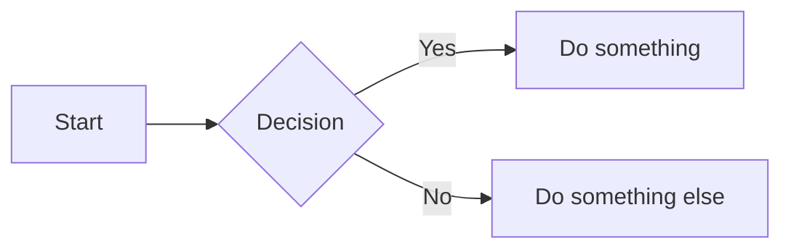

# Slidev Reference Guide

A quick reference for creating presentations with Slidev.

---

## Table of Contents

1. [Getting Started](#getting-started)
2. [Slide Basics](#slide-basics)
3. [Click Animations](#click-animations)
4. [Speaker Notes](#speaker-notes)
5. [Layouts](#layouts)
6. [Components](#components)
7. [Drawing & Annotations](#drawing--annotations)
8. [Diagrams & Math](#diagrams--math)
9. [Keyboard Shortcuts](#keyboard-shortcuts)
10. [Theming](#theming)
11. [Commands](#commands)

---

## Getting Started

### New Project

```bash
npm init slidev@latest
```

### Add to Existing Project

```bash
npm install @slidev/cli @slidev/theme-default
```

### Run Development Server

```bash
pnpm dev
```

---

## Slide Basics

### Frontmatter (First Slide)

```yaml
---
theme: ./theme
title: My Presentation
info: |
  ## Presentation Description
  Author info here
layout: center
highlighter: shiki
transition: slide-left
mdc: true
drawings:
  persist: true
---
```

### Slide Separator

Use `---` to separate slides:

```markdown
# Slide 1

Content here

---

# Slide 2

More content
```

---

## Click Animations

### Single Element

```html
<v-click>

This appears on click.

</v-click>
```

### Sequential List

```html
<v-clicks>

- First item (click 1)
- Second item (click 2)
- Third item (click 3)

</v-clicks>
```

### Custom Order

```html
<div v-click="3">Shows third</div>
<div v-click="1">Shows first</div>
<div v-click="2">Shows second</div>
```

### Hide on Click

```html
<div v-click.hide>Disappears on click</div>
```

### Images with Click

```html
<v-click>


</v-click>
```

---

## Speaker Notes

Notes go in HTML comments at the **end** of each slide:

```markdown
# Slide Title

Slide content here.

<!--
Speaker notes go here.
Supports **markdown** formatting.

[click] This syncs with click animations
[click] Second click note
-->
```

---

## Layouts

### Available Layouts

| Layout | Description |
|--------|-------------|
| `default` | Standard slide |
| `center` | Centered content |
| `cover` | Title slide |
| `two-cols` | Two columns |
| `image-right` | Image on right |
| `image-left` | Image on left |

### Usage

```markdown
---
layout: center
---

# Centered Title

---
layout: two-cols
---

# Left Column

Content here

::right::

# Right Column

More content

---
layout: image-right
image: ./path/to/image.jpg
---

# Title

Content on left side
```

---

## Components

### Arrow

```html
<!-- Basic arrow -->
<Arrow x1="10" y1="20" x2="100" y2="200" />

<!-- Two-way arrow -->
<Arrow x1="50" y1="100" x2="300" y2="100" two-way />

<!-- Styled arrow -->
<Arrow x1="10" y1="10" x2="200" y2="200" color="red" width="3" />

<!-- Draggable arrow -->
<v-drag-arrow two-way />
```

### Webcam

```html
<Webcam />
```

### Tweet

```html
<Tweet id="1390115482657726468" />
```

### YouTube

```html
<Youtube id="dQw4w9WgXcQ" />
```

### Conditional Rendering

```html
<RenderWhen context="presenter">
  Only visible in presenter view
</RenderWhen>
```

---

## Drawing & Annotations

Built-in drawing powered by [drauu](https://github.com/antfu/drauu).

### Enable

- Click the **pen icon** in toolbar
- Or press `d`

### Drawing Modes

| Mode | Description |
|------|-------------|
| Stylus | Freehand drawing |
| Line | Straight lines |
| Arrow | Arrows |
| Rectangle | Rectangles |
| Ellipse | Circles/ellipses |

### Persistence Config

```yaml
---
drawings:
  persist: true    # Save between sessions
  syncAll: true    # Sync across instances
---
```

---

## Diagrams & Math

### Mermaid Diagrams

````markdown

````

### LaTeX Math

```markdown
Inline: $E = mc^2$

Block:
$$
\int_0^\infty e^{-x^2} dx = \frac{\sqrt{\pi}}{2}
$$
```

### Monaco Editor (Live Code)

````markdown
```ts {monaco}
// Editable code block
const greeting = 'Hello World'
console.log(greeting)
```
````

---

## Keyboard Shortcuts

### Navigation

| Key | Action |
|-----|--------|
| `←` / `→` | Previous / Next slide |
| `Space` | Next click or slide |
| `o` | Slide overview |
| `g` | Go to slide number |

### Presentation

| Key | Action |
|-----|--------|
| `p` | Toggle laser pointer |
| `d` | Toggle drawing mode |
| `f` | Toggle fullscreen |
| `Esc` | Exit fullscreen / overview |

### Presenter

| Key | Action |
|-----|--------|
| `P` (Shift+p) | Open presenter view |

---

## Theming

### Theme Structure

```
my-theme/
├── package.json
├── styles/
│   └── index.css
├── layouts/
│   ├── default.vue
│   ├── cover.vue
│   └── center.vue
├── components/
│   └── MyComponent.vue
└── setup/
    └── shiki.ts
```

### Theme package.json

```json
{
  "name": "slidev-theme-mytheme",
  "engines": {
    "slidev": ">=0.48.0"
  },
  "slidev": {
    "colorSchema": "dark",
    "highlighter": "shiki",
    "defaults": {
      "fonts": {
        "sans": "Nunito Sans",
        "mono": "JetBrains Mono"
      }
    }
  }
}
```

### Using Local Theme

```yaml
---
theme: ./theme
---
```

---

## Commands

```bash
# Development
pnpm dev                    # Start dev server
pnpm dev --port 3030        # Custom port
pnpm dev --open presenter   # Open presenter mode

# Build
pnpm build                  # Build static site

# Export
pnpm export                 # Export to PDF
pnpm export --format png    # Export to PNG images
```

---

## Marp vs Slidev

| Feature | Marp | Slidev |
|---------|------|--------|
| Click animations | ❌ | ✅ `v-click` |
| Speaker notes | ✅ | ✅ |
| Layouts | CSS classes | Vue layouts |
| Theming | CSS only | Vue + CSS |
| Components | ❌ | ✅ Vue components |
| Live coding | ❌ | ✅ Monaco editor |
| Drawing | ❌ | ✅ Built-in |
| Diagrams | ❌ | ✅ Mermaid |
| Export | PDF, PPTX | PDF, PNG, SPA |
