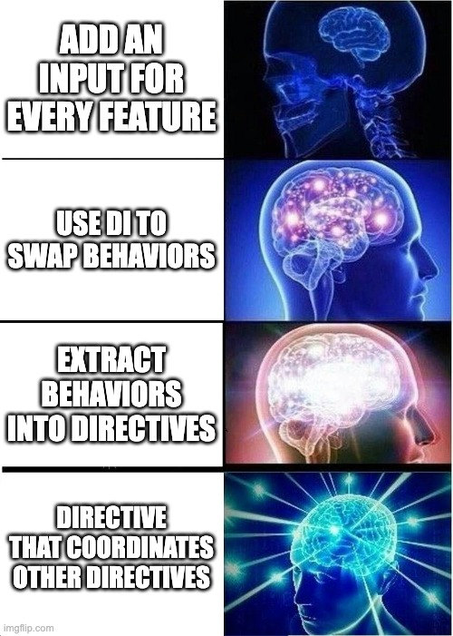

<!-- _class: title -->

# Decoupling in Angular
## Letting the Code Tell You What It Needs

**Dor Peled** · @Knat-Dev
Software Engineer @ Coralogix

---

# About Me

```
Dor Peled
@Knat-Dev

Software Engineer @ Coralogix
I tend to stay with hard things longer than is comfortable
```

<!--
Hey everyone, I'm Dor. I'm a software engineer at Coralogix.

I've noticed something about myself over the years. When something gets complicated or messy, I usually don't bounce right away. I tend to sit with it and try to understand what's actually going on.

That shows up in different places. In music, I play technical metal. In reading, I gravitate toward long, dense series like Malazan Book of the Fallen and The Wheel of Time.

And large Angular codebases behave the same way. They don't fail immediately. They accumulate complexity quietly. And if you don't stay with them long enough, you miss the signals that tell you what they actually need.

So this talk isn't about best practices or patterns. It's about what I learned by staying with components that were under pressure.

How do you know when a component needs to be split up? And more importantly, how do you split it without guessing?

I'm gonna give you a mental model. Four tools, and the cues that tell you when to use each one.
-->

---

# The Universal Story

```
Every Angular dev has written this component:

Month 1: Clean, simple, works great
Month 6: "Why is this so hard to change?"
```

<!--
So here's a story you've probably lived.

Month one, you build a component. It's clean. Two inputs, maybe an output. Life is good.

Month six, product wants a variation. And you realize... this thing is stuck. Every change breaks something else.
-->

---

# Our Example: DataGrid

```typescript
// Month 1
@Component({ selector: 'app-data-grid' })
export class DataGridComponent<T> {
  data = input<T[]>([]);
  columns = input<ColumnDef<T>[]>([]);
  loading = input(false);
}
```

<!--
Let's use a data grid as our example. Everyone's built one of these, right?

Month one - three inputs. Data, columns, loading state. That's it. Clean.
-->

---

# Month 6

```typescript
// Month 6
@Component({ selector: 'app-data-grid' })
export class DataGridComponent<T> {
  data = input<T[]>([]);
  columns = input<ColumnDef<T>[]>([]);
  loading = input(false);
  sortable = input(false);
  filterable = input(false);
  editable = input(false);
  persistColumns = input(false);
  showContextMenu = input(false);
  // ... and it keeps growing
}
```

<!--
Month six. Sortable, filterable, editable, persist columns, context menu...

And here's the thing - we didn't inherit this mess. We built it. One reasonable feature at a time.
-->

---

<!-- _class: image-slide -->


---

# The Real Problem

```
Coupling isn't the problem.

Hidden coupling is.
```

<!--
But here's what I want you to understand.

Coupling isn't bad. Every system has coupling. The problem is when coupling is hidden. When you can't see it, you can't manage it.

Today I'll show you four tools Angular gives us, and the tells that show you when to reach for each one.
-->

---

# The Four Tools

```
1. Inputs/Outputs     → Parent configures child
2. Content Projection → Structure varies
3. Strategy via DI    → Behavior A or B
4. Directives         → Behavior A and B and C
```

<!--
These are our four tools. Each one solves a different problem.

The trick isn't knowing the tools - you probably know all of these. The trick is recognizing WHEN to use each one.
-->

---

# Tool 1: Inputs/Outputs

```
The Baseline

Parent decides WHAT.
Child decides HOW.
```

<!--
Inputs and outputs. Everyone's first tool.

Parent passes data down, child emits events up. Simple. This is where you start, and honestly, it's where you should stay as long as possible.
-->

---

# Inputs: The Code

```typescript
@Component({ selector: 'app-data-grid' })
export class DataGridComponent<T> {
  data = input<T[]>([]);
  columns = input<ColumnDef<T>[]>([]);
  loading = input(false);

  rowClicked = output<T>();
}
```

```html
<app-data-grid
  [data]="items"
  [columns]="columns"
  [loading]="isLoading"
  (rowClicked)="onSelect($event)"
/>
```

<!--
Clean contract. Parent owns the data, child owns the rendering. They can evolve independently.

This is the right abstraction for simple cases.
-->

---

# The Smell: Boolean Flags

```typescript
// The smell:
readonly isAdmin = input(false);
readonly isReadOnly = input(false);
readonly isCompactMode = input(false);

// Component checking who's using it:
if (this.isAdmin()) {
  // show delete button
}
if (this.isCompactMode()) {
  // hide some columns
}
```

<!--
But here's the smell that inputs are breaking down.

Boolean flags. The component is asking 'who's using me?' and changing behavior based on the answer.

When you see if-branches based on context flags, inputs have outgrown their welcome.
-->

---

# Tool 2: Content Projection

```
When STRUCTURE varies.

Not behavior. Structure.
```

<!--
Content projection. The parent passes structure in, not configuration down.

Use this when the variation is about WHAT goes WHERE. Headers, footers, custom templates.
-->

---

# Content Projection: The Code

```typescript
@Component({
  selector: 'app-card',
  template: `
    <div class="card">
      <div class="header">
        <ng-content select="[header]" />
      </div>
      <ng-content />
    </div>
  `,
})
export class CardComponent {}
```

```html
<app-card>
  <h2 header>My Title</h2>
  <p>Card content here</p>
</app-card>
```

<!--
The card owns layout. The consumer owns content.

Different consumers can put different things in, but the card doesn't need to know or care.
-->

---

# The Tell: Behavior, Not Structure

```
Content projection works for:
  ✓ Headers and footers
  ✓ Custom row templates
  ✓ Action buttons

Doesn't work for:
  ✗ "Save to localStorage vs server"
  ✗ "Sort ascending vs descending by default"
  ✗ "Fetch data this way vs that way"
```

<!--
But here's the tell it's breaking down.

You need different BEHAVIOR, not different structure. Content projection can't help you there.

If you're trying to ng-content a function... you've gone too far.
-->

---

# Tool 3: Strategy via DI

```
When behavior is exclusive.

A or B. Never both.
```

<!--
Strategy pattern via dependency injection.

This is for mutually exclusive behavior. Exactly one implementation wins at runtime.
-->

---

# Strategy: The Problem

```typescript
// The grid needs to persist column state
// But WHERE it persists depends on context:

// Admin dashboard → save to server
// Public view → save to localStorage
// Preview mode → don't save at all
```

<!--
Let's say our grid persists column state. Width, order, visibility.

But where it saves depends on who's using it. Server for admins, localStorage for regular users, nowhere for previews.

Three different behaviors. The grid shouldn't know which one.
-->

---

# Strategy: The Interface

```typescript
// Define WHAT, not HOW
export interface StorageStrategy {
  save(key: string, data: unknown): void;
  load(key: string): unknown | null;
}

// Create a token
export const STORAGE_STRATEGY =
  new InjectionToken<StorageStrategy>('StorageStrategy');
```

<!--
Step one - define the contract. Save and load. That's it.

The token lets Angular swap implementations.
-->

---

# Strategy: The Implementations

```typescript
// Implementation A: localStorage
export class LocalStorageStrategy implements StorageStrategy {
  save(key: string, data: unknown) {
    localStorage.setItem(key, JSON.stringify(data));
  }
  load(key: string) {
    return JSON.parse(localStorage.getItem(key) ?? 'null');
  }
}

// Implementation B: Server
export class ServerStorageStrategy implements StorageStrategy {
  save(key: string, data: unknown) {
    this.http.post('/api/preferences', { key, data });
  }
  load(key: string) {
    return this.http.get(`/api/preferences/${key}`);
  }
}
```

<!--
Two implementations. Same interface. The grid doesn't know which one it's using.
-->

---

# Strategy: The Provider

```typescript
// Context A: Admin dashboard
@Component({
  providers: [
    { provide: STORAGE_STRATEGY, useClass: ServerStorageStrategy }
  ]
})
export class AdminDashboard {}

// Context B: Public view
@Component({
  providers: [
    { provide: STORAGE_STRATEGY, useClass: LocalStorageStrategy }
  ]
})
export class PublicView {}
```

<!--
The decision lives in the provider. Same grid component, different storage behavior.

Zero if-statements in the grid. The context decides, not the component.
-->

---

# Provider Functions

```typescript
// Bundle defaults into a reusable function
export function provideStorageDefaults(): Provider[] {
  return [
    { provide: STORAGE_STRATEGY, useClass: LocalStorageStrategy }
  ];
}

// Provide once at app or feature level
bootstrapApplication(AppComponent, {
  providers: [provideStorageDefaults()]
});

// Override only where needed
@Component({
  providers: [
    { provide: STORAGE_STRATEGY, useClass: ServerStorageStrategy }
  ]
})
export class AdminDashboard {}
```

<!--
Pro tip - bundle your defaults into a provider function.

Call it once at the top. Everything below gets the default. Override only where you need something different.

DI hierarchy does the rest. Closest parent wins.
-->

---

# The Cue: God Component

```typescript
// The grid owns ALL the behaviors:
@Component(...)
export class DataGridComponent {
  #storage = inject(STORAGE_STRATEGY);
  #sorter = inject(SORT_STRATEGY);
  #filter = inject(FILTER_STRATEGY);
  #selection = inject(SELECTION_STRATEGY);
  // Can't opt out of any of these
}
```

<!--
But here's the cue that something's wrong.

The component is injecting four strategies. Six. Ten. It's becoming a god component.

Even with provider functions, you can't opt out. Every grid has storage, sorting, filtering, selection - whether you want them or not.

The component is doing too much. It owns behaviors that should be optional.
-->

---

<!-- _class: image-slide -->


---

# Tool 4: Directive Composition

```
When behaviors ACCUMULATE.

A and B and C.
```

<!--
Directive composition.

Each behavior is a directive. They don't replace each other - they stack. They compose by addition.
-->

---

# Directives: The Code

```typescript
@Directive({ selector: 'app-data-grid[persistColumns]' })
export class PersistColumnsDirective {
  #storage = inject(STORAGE_STRATEGY);
  // Uses whatever strategy is provided above in the tree
}

@Directive({ selector: 'app-data-grid[sortable]' })
export class SortableDirective {
  #grid = inject(DataGridComponent);
  // Adds sorting behavior
}
```

<!--
Each directive owns one behavior.

The directive can use a strategy internally. It picks up whatever's provided in the DI tree - from the provider function we set up earlier.

The directive is composable - you add it or you don't. The strategy inside is exclusive - localStorage OR server, never both.
-->

---

# Directives: Override When Needed

```typescript
// Most consumers: just add the directive, default works
<app-data-grid persistColumns [data]="items" />

// Admin dashboard needs server storage:
@Component({
  providers: [
    { provide: STORAGE_STRATEGY, useClass: ServerStorageStrategy }
  ]
})
export class AdminDashboard {}

// Template is identical - directive picks up the override
<app-data-grid persistColumns [data]="items" />
```

<!--
Most consumers just add the directive. The default works.

But when you need different behavior, override the token in your component. The directive picks it up through DI hierarchy. Zero changes to the template.
-->

---

# Directives: The Usage

```html
<!-- Simple grid: just sorting -->
<app-data-grid sortable [data]="items" />

<!-- Full-featured: everything -->
<app-data-grid
  sortable
  filterable
  persistColumns
  contextMenu
  [data]="items"
/>
```

<!--
Compose what you need. Skip what you don't.

Simple view gets one directive. Power user view gets four. Same component.
-->

---

# Directive Communication

```typescript
@Directive({ selector: 'app-data-grid[sortable]' })
export class SortableDirective {
  // Inject the host component
  #grid = inject(DataGridComponent);

  constructor() {
    // React to grid state via signals
    effect(() => {
      const data = this.#grid.data();
      // Apply sorting...
    });
  }
}
```

<!--
How do directives talk to the component? They inject it.

The component exposes signals. Directives read them, react to them, modify behavior.

No special events. No services between them. Just signals.
-->

---

# The Sign: Repeated Patterns

```html
<!-- Page A -->
<app-data-grid sortable filterable persistColumns contextMenu />

<!-- Page B -->
<app-data-grid sortable filterable persistColumns contextMenu />

<!-- Page C -->
<app-data-grid sortable filterable persistColumns contextMenu />
```

<!--
But here's the sign that directives need one more step.

Same four directives. Copy-pasted three times. That's implicit coupling through repetition.

If this pattern appears three times, it's not a coincidence. It's a concept that needs a name.
-->

---

<!-- _class: image-slide -->


---

# The Promotion Rule

```
Two times is coincidence.
Three times is a concept.

Name it.
```

<!--
This is the core insight.

Two times might be coincidence. Three times? That's a concept hiding in plain sight.

When you see the same pattern three times, the code is telling you something's missing from your vocabulary.
-->

---

# hostDirectives

```typescript
@Directive({
  selector: '[simpleGrid]',
  hostDirectives: [
    SortableDirective,
    FilterableDirective,
  ],
})
export class SimpleGridDirective {}

@Directive({
  selector: '[powerGrid]',
  hostDirectives: [
    SortableDirective,
    FilterableDirective,
    PersistColumnsDirective,
    ContextMenuDirective,
  ],
})
export class PowerGridDirective {}
```

<!--
Host directives let you bundle directives into a named concept.

Simple grid, power grid. One attribute instead of four. And now you can talk about it, test it, document it.
-->

---

# Before/After

```html
<!-- Before: 4 attributes everywhere -->
<app-data-grid
  sortable
  filterable
  persistColumns
  contextMenu
  [data]="items"
/>

<!-- After: 1 named concept -->
<app-data-grid
  powerGrid
  [data]="items"
/>
```

<!--
Four attributes become one.

But more importantly - the pattern has a name now. 'Power grid' is a thing in your codebase. It's not just 'grid with these four directives'.
-->

---

<!-- _class: image-slide -->


---

# Coordinator Directive

```typescript
// Sorting and persistence need to work together:
// When sort changes → persist the new sort
// On init → restore persisted sort

@Directive({
  selector: 'app-data-grid[persistedSort]',
  hostDirectives: [SortableDirective, PersistColumnsDirective],
})
export class PersistedSortDirective {
  #sortable = inject(SortableDirective);
  #persist = inject(PersistColumnsDirective);

  constructor() {
    // Coordinate the coupling
    effect(() => {
      const sort = this.#sortable.currentSort();
      this.#persist.save('sort', sort);
    });
  }
}
```

<!--
Here's a powerful pattern. Sometimes directives A and B need to be coupled - by product spec.

When sorting changes, persist it. On load, restore it. These two need to talk.

Instead of coupling them inside the grid, create a COORDINATOR directive. It hosts both directives and manages their interaction.

The grid stays dumb. The coupling is explicit and testable.
-->

---

<!-- _class: image-slide -->



---

# The Decision Framework

| Cue | Tool |
|-----|------|
| Parent configures child | Inputs/Outputs |
| Boolean flags, if-branches | Time to graduate |
| Structure varies | Content Projection |
| Behavior A or B | Strategy via DI |
| Repeated provider setup | Provider functions |
| Behaviors A and B and C | Directives |
| Directive needs flexibility | Strategy inside directive |
| Same combo 3x | hostDirectives |
| A and B must be coupled | Coordinator directive |

<!--
Here's the mental model on one slide.

It's not 'which pattern is best'. It's 'what is the code telling me right now?'

Each row is a response to a cue. You don't pick upfront. You listen.
-->

---

# Your Monday Morning

```
Find your biggest component.
Count the inputs.
Find the if-branches.

Ask: "What is this telling me?"
```

<!--
Here's your homework.

Monday morning. Find the scariest component in your codebase. Count the inputs. Find the if-statements that check context.

Ask yourself: what is this telling me? What tool does it point to?

You might not refactor it. But you'll see it differently.
-->

---

# The Takeaway

```
Good abstractions aren't chosen.

They're discovered.
```

<!--
Angular gives us the tools. Inputs, content projection, DI, directives, host directives.

Our job isn't to pick our favorite and force it everywhere.

Our job is to listen to the code. Notice the repetition. Recognize the patterns.

Good abstractions aren't chosen. They're discovered.
-->

---

<!-- _class: title -->

# Thank You

**Dor Peled**
@Knat-Dev

Questions?

<!--
Thanks for listening. I'm Dor, Knat-Dev online.

Come find me if you wanna talk about Angular, decoupling, or why your component has 47 inputs.

Questions?
-->
